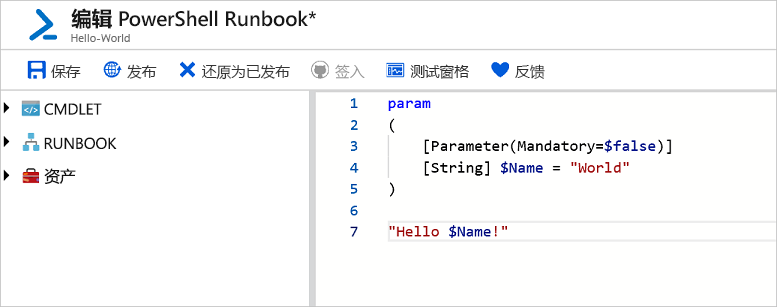
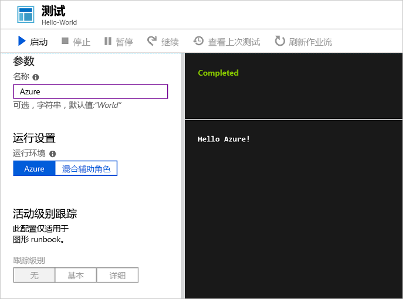
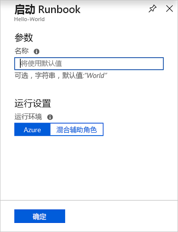
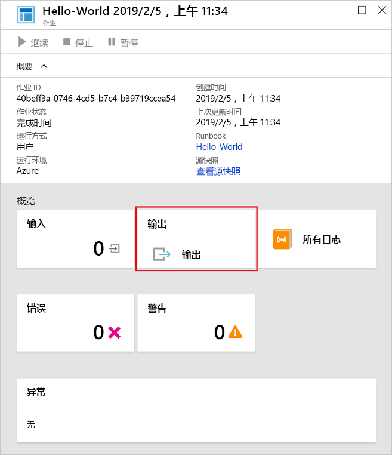
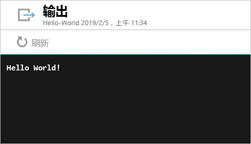

# <a name="create-an-azure-automation-runbook"></a>创建 Azure 自动化 Runbook

Azure 自动化 Runbook 可以通过 Azure 创建。 此方法提供一个基于浏览器的用户界面，用于创建自动化 Runbook。 本快速入门介绍如何创建、编辑、测试和发布自动化 PowerShell Runbook。

如果还没有 Azure 订阅，可以在开始前创建一个[免费 Azure 帐户](https://azure.microsoft.com/free/?WT.mc_id=A261C142F)。

## <a name="sign-in-to-azure"></a>登录 Azure

登录 Azure (https://portal.azure.com )

## <a name="create-runbook"></a>创建 Runbook

首先，请创建 Runbook。 本快速入门中创建的示例 Runbook 默认输出 `Hello World`。

1. 打开自动化帐户。

1. 单击“流程自动化”下的“Runbook”。   此时会显示 Runbook 列表。

1. 单击列表顶部的“创建 Runbook”按钮 

1. 输入“Hello-World”作为 Runbook **名称**，选择 **PowerShell** 作为 **Runbook 类型**。 单击“创建”。 

   

1. 此时会创建 Runbook 并打开“编辑 PowerShell Runbook”页面。 

    

1. 将以下代码键入或者复制并粘贴到编辑窗格中。 此代码创建名为“名称”的可选输入参数，其默认值为“World”，并输出使用以下输入值的字符串：

   ```powershell-interactive
   param
   (
       [Parameter(Mandatory=$false)]
       [String] $Name = "World"
   )

   "Hello $Name!"
   ```

1. 单击“保存”  ，保存 Runbook 的草稿副本。

    

## <a name="test-the-runbook"></a>测试 Runbook

创建 Runbook 之后，请对其进行测试以验证其是否正常。

1. 单击“测试窗格”  打开“测试”页。 

1. 输入一个值作为“名称”  ，然后单击“启动”。  此时会启动测试作业并显示作业状态和输出。

    

1. 单击右上角的“X”关闭“测试”页。   在显示的弹出窗口中选择“确定”。 

1. 在“编辑 PowerShell Runbook”页中单击“发布”，   将此 Runbook 作为帐户中的正式版 Runbook 发布。

   

## <a name="run-the-runbook"></a>运行 Runbook

Runbook 发布以后，会显示概览页。

1. 在 Runbook 概览页中，单击“启动”打开该 Runbook 的“启动 Runbook”配置页。  

   

1. 将“名称”保留为空，以便使用默认值，然后单击“确定”。   此时会提交 Runbook 作业，并显示作业页。

   

1. 当“作业状态”为“正在运行”或“已完成”后，单击“输出”打开“输出”窗格并查看 Runbook 输出。     

   

## <a name="clean-up-resources"></a>清理资源

不再需要 Runbook 时，即可将其删除。 为此，请在 Runbook 列表中选择 Runbook，然后单击“删除”。 

## <a name="next-steps"></a>后续步骤

本快速入门介绍了如何创建、编辑、测试和发布 Runbook，以及如何启动 Runbook 作业。 若要详细了解自动化 Runbook，请继续阅读可以在自动化中创建和使用的不同 Runbook 类型的相关文章。

> [!div class="nextstepaction"]
> [自动化指南 - Runbook 类型](./automation-runbook-types.md)
