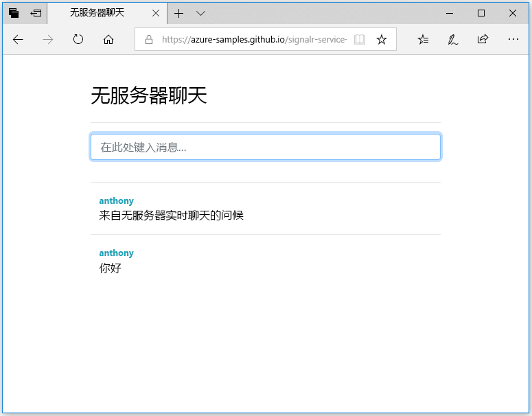

## 运行 Web 应用程序

1. 为方便起见，GitHub 中有一个示例单页 Web 应用程序。 将浏览器打开至 [https://azure-samples.github.io/signalr-service-quickstart-serverless-chat/demo/chat-v2/](https://azure-samples.github.io/signalr-service-quickstart-serverless-chat/demo/chat-v2/)。

    > [!NOTE]
    > HTML 文件的源位于 [/docs/demo/chat-v2/index.html](https://github.com/Azure-Samples/signalr-service-quickstart-serverless-chat/blob/master/docs/demo/chat-v2/index.html)。

1. 系统提示输入函数应用的基 URL 时，输入 `http://localhost:7071`。

1. 出现提示时输入用户名。

1. Web 应用程序调用函数应用中的 *GetSignalRInfo* 函数来检索连接信息以连接到 Azure SignalR 服务。 连接完成后，将显示聊天消息输入框。

1. 键入消息，然后按 Enter。 应用程序将该消息发送到 Azure Function 应用中的 *SendMessage* 函数，然后后者使用 SignalR 输出绑定将该消息广播到所有连接的客户端。 如果一切正常工作，该消息应该出现在应用程序中。

    

1. 在另一个浏览器窗口中打开另一个 Web 应用程序实例。 你将看到发送的任何消息都将出现在应用程序的所有实例中。

> [!IMPORTANT]
> 由于 HTML 页面是使用 HTTPS 提供的，但本地 Azure Functions 运行时默认使用 HTTP，因此浏览器（例如 Firefox）可能会强制执行阻止从网页到函数的请求的混合内容策略。 要解决此问题，请使用没有此限制的浏览器或启动本地 HTTP 服务器，例如 /docs/demo/chat-v2 目录中的 [http-server](https://www.npmjs.com/package/http-server)  。 请确保将原点添加到 local.settings.json 中的 `CORS` 设置  。