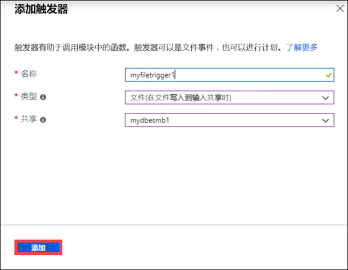
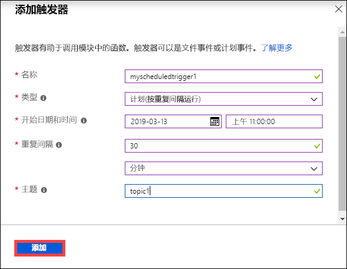
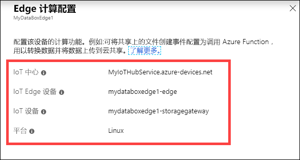
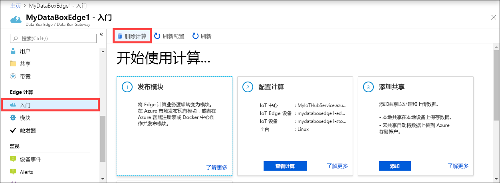
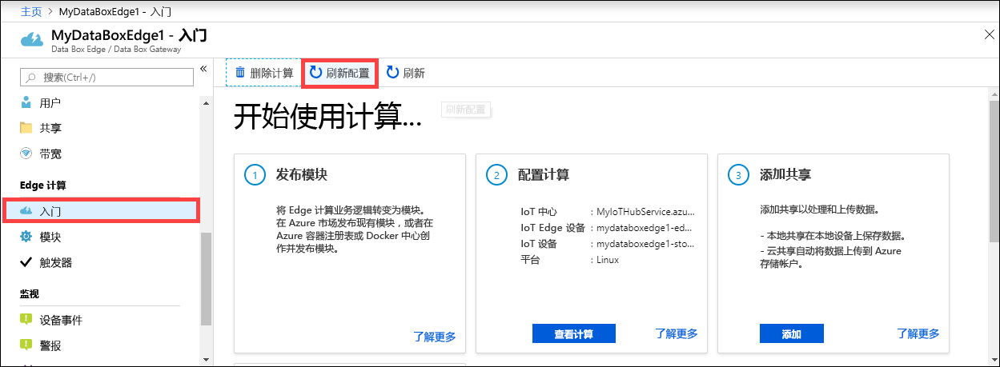

# 在 Azure Data Box Edge 中管理计算

本文介绍如何在 Azure Data Box Edge 中管理计算。 可以通过 Azure 门户或本地 Web UI 管理计算。 使用 Azure 门户可以管理模块、触发器和计算配置，使用本地 Web UI 可以管理计算设置。

在本文中，学习如何：

> [!div class="checklist"]
> * 管理触发器
> * 管理计算配置

## 管理触发器

事件是在云环境中或者在设备上发生的、可能需要采取措施的情况。 例如，在共享中创建文件就是一个事件。 触发器引发这些事件。 对于 Data Box Edge，触发器可用于响应文件事件或计划。

- **文件**：这些触发器可用于响应文件创建、文件修改等文件事件。
- **Scheduled**：这些触发器可用于响应某个计划，对于该计划，可以定义开始日期、开始时间和重复间隔。

### 添加触发器

在 Azure 门户中执行以下步骤可以创建触发器。

1. 在 Azure 门户中转到你的 Data Box Edge 资源，然后转到“Edge 计算”>“触发器”。  在命令栏上选择“+ 添加触发器”  。

    

2. 在“添加触发器”边栏选项卡中，提供触发器的唯一名称。 
    
    <!--Trigger names can only contain numbers, lowercase letters, and hyphens. The share name must be between 3 and 63 characters long and begin with a letter or a number. Each hyphen must be preceded and followed by a non-hyphen character.-->

3. 选择触发器的**类型**。 如果该触发器用于响应文件事件，请选择“文件”。  如果希望该触发器在定义的时间启动并按指定的重复间隔运行，请选择“计划”。  根据所做的选择，屏幕上会显示一组不同的选项。

    - **文件触发器** - 从下拉列表中选择一个装载的共享。 当此共享中激发文件事件时，该触发器会调用某个 Azure 函数。

        

    - **计划的触发器** - 指定开始日期/时间，并以小时、分钟或秒为单位指定重复间隔。 此外，请输入主题的名称。 使用主题可以灵活地将触发器路由到设备上部署的模块。

        示例路由字符串：`"route3": "FROM /* WHERE topic = 'topicname' INTO BrokeredEndpoint("modules/modulename/inputs/input1")"`。

        

4. 选择“添加”  以创建该触发器。 此时会显示一条通知，指出正在创建触发器。 创建触发器后，边栏选项卡会更新以反映新的触发器。
 
    

### 删除触发器

在 Azure 门户中执行以下步骤可以删除触发器。

1. 在触发器列表中，选择要删除的触发器。

    

2. 单击右键并选择“删除”  。

    

3. 出现确认提示时，单击“是”  。

    

触发器列表将会更新以反映删除后的结果。

## 管理计算配置

使用 Azure 门户可以查看计算配置、删除现有的计算配置，或者刷新计算配置以便同步 Data Box Edge 的 IoT 设备和 IoT Edge 设备的访问密钥。

### 查看计算配置

在 Azure 门户中执行以下步骤可以查看设备的计算配置。

1. 在 Azure 门户中转到你的 Data Box Edge 资源，然后转到“Edge 计算”>“模块”。  在命令栏上选择“查看计算”。 

    

2. 记下设备上的计算配置。 配置计算时，已创建一个 IoT 中心资源。 在该 IoT 中心资源下，已配置 IoT 设备和 IoT Edge 设备。 仅支持在 IoT Edge 设备上运行 Linux 模块。

    

### 删除计算配置

在 Azure 门户中执行以下步骤可以删除设备的现有 Edge 计算配置。

1. 在 Azure 门户中转到你的 Data Box Edge 资源，然后转到“Edge 计算”>“开始”。  在命令栏上选择“删除计算”。 

    

2. 删除计算配置后，如果需要再次使用计算，则重新配置设备。 出现确认提示时，选择“是”  。

    

### 同步 IoT 设备和 IoT Edge 设备的访问密钥

在 Data Box Edge 中配置计算时，会创建 IoT 设备和 IoT Edge 设备。 系统会自动为这些设备分配对称访问密钥。 最佳安全做法是通过 IoT 中心服务定期轮换这些密钥。

若要轮换这些密钥，可以转到创建的 IoT 中心服务，并选择该 IoT 设备或 IoT Edge 设备。 每个设备都有一个主要访问密钥和辅助访问密钥。 将主要访问密钥分配到辅助访问密钥，然后重新生成主要访问密钥。

如果已轮换 IoT 设备和 IoT Edge 设备的密钥，需要刷新 Data Box Edge 中的配置才能获取最新的访问密钥。 同步可帮助设备获取 IoT 设备和 IoT Edge 设备的最新密钥。 Data Box Edge 仅使用主要访问密钥。

在 Azure 门户中执行以下步骤可以同步设备的访问密钥。

1. 在 Azure 门户中转到你的 Data Box Edge 资源，然后转到“Edge 计算”>“开始”。  在命令栏上选择“刷新配置”。 

    

2. 出现确认提示时，选择“是”。 

     

3. 同步完成后，请退出对话框。

## 后续步骤

- 了解如何[管理边缘计算通过 Azure 门户的网络](data-box-edge-extend-compute-access-modules.md)。
