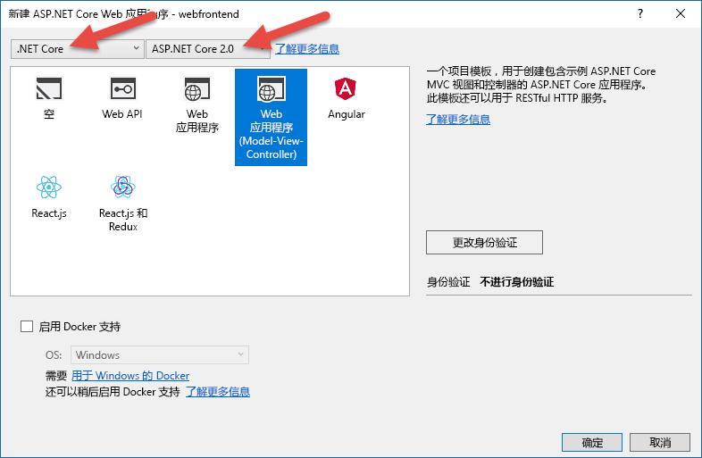
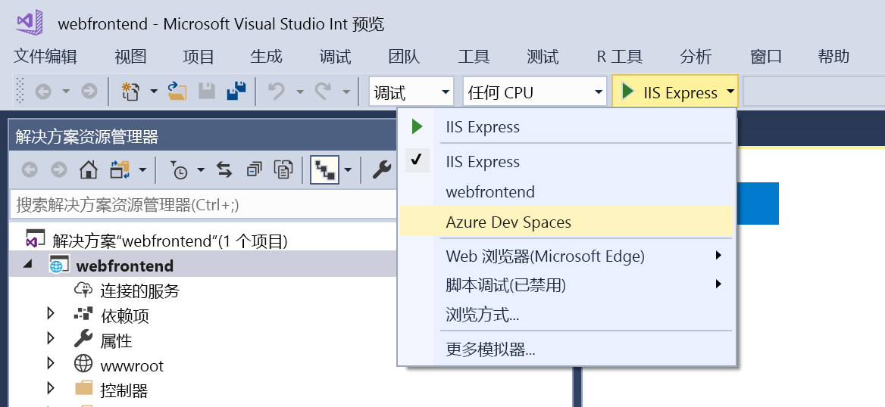
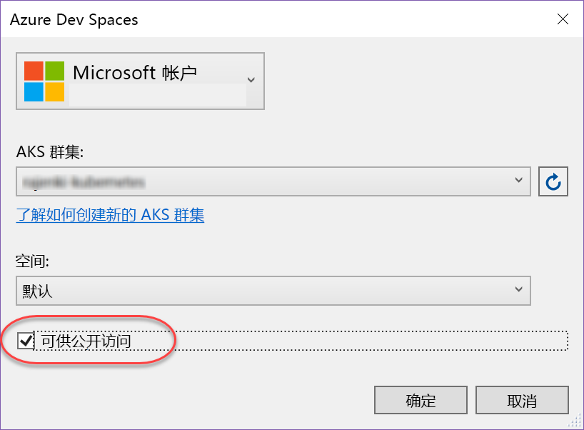
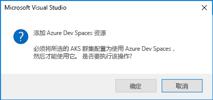

# <a name="get-started-on-azure-dev-spaces-with-net-core-and-visual-studio"></a>在 .NET Core 和 Visual Studio 中开始使用 Azure Dev Spaces

本指南介绍如何：

- 使用 Azure 中的托管 Kubernetes 群集设置 Azure Dev Spaces。
- 使用 Visual Studio 在容器中以迭代方式开发代码。
- 独立开发两个独立的服务，并使用 Kubernetes 的 DNS 服务发现来调用另一个服务。
- 在团队环境中高效地开发和测试代码。

> [!Note]
> **如果在任何时候遇到问题**，请参阅[故障排除](troubleshooting.md)部分。


## <a name="create-a-kubernetes-cluster-enabled-for-azure-dev-spaces"></a>创建为 Azure Dev Spaces 启用的 Kubernetes 群集

1. 通过 https://portal.azure.com 登录到 Azure 门户。
1. 选择“创建资源”，搜索“Kubernetes”，选择“Kubernetes 服务” > “创建”     。

   在“创建 Kubernetes 群集”  表单的每个标题下完成以下步骤，并验证所选[区域是否支持 Azure Dev Spaces][supported-regions]。

   - **项目详细信息**：选择 Azure 订阅和一个新的或现有的 Azure 资源组。
   - **群集详细信息**：输入 AKS 群集的名称、区域、版本和 DNS 名称前缀。
   - **规模**：选择 AKS 代理节点的 VM 大小和节点数。 如果是刚开始使用 Azure Dev Spaces，则采用一个节点来公开所有功能就足够了。 在部署群集后，随时可以轻松调整节点数。 请注意，在部署 AKS 群集后无法更改 VM 大小。 但是，在部署 AKS 群集后，如果需要纵向扩展，可以轻松创建具有更大 VM 的新 AKS 群集并使用 Dev Spaces 重新部署到该更大的群集。

   


   在完成时选择“下一步:  身份验证”。

1. 为基于角色的访问控制 (RBAC) 选择所需设置。 Azure Dev Spaces 支持启用或禁用了 RBAC 的群集。

    

1. 完成时依次选择“评审 + 创建”、“创建”   。

## <a name="get-the-visual-studio-tools"></a>获取 Visual Studio 工具
安装最新版本的 [Visual Studio](https://www.visualstudio.com/vs/)。 对于 Windows 版 Visual Studio 2019，需要安装“Azure 开发”工作负荷。 对于 Windows 版 Visual Studio 2017，需要安装 ASP.NET 和“Web 开发”工作负荷以及 [Visual Studio Tools for Kubernetes](https://aka.ms/get-azds-visualstudio)。

## <a name="create-a-web-app-running-in-a-container"></a>创建在容器中运行的 Web 应用

在此部分中，将创建一个 ASP.NET Core Web 应用并让其在 Kubernetes 的容器中运行。

### <a name="create-an-aspnet-web-app"></a>创建 ASP.NET Web 应用

在 Visual Studio 中创建新项目。 目前，该项目必须是 **ASP.NET Core Web 应用程序**。 将该项目命名为“webfrontend”。 


选择“Web 应用程序(模型-视图-控制器)”模板，  确保以对话框顶部两个下拉列表中的 **.NET Core** 和 **ASP.NET Core 2.0** 为目标。 单击“确定”以创建该项目  。



### <a name="enable-dev-spaces-for-an-aks-cluster"></a>为 AKS 群集启用 Dev Spaces

使用刚才创建的项目，从启动设置下拉列表中选择“Azure Dev Spaces”，如下所示。 



在旁边显示的对话框中，确保已使用适当的帐户登录，然后选择一个现有的 Kubernetes 群集。


暂时让“空间”下拉列表默认为 `default`。  稍后会详细介绍此选项。 选中“可公开访问”复选框，允许通过公共终结点访问 Web 应用。  此设置不是必需的，但可以稍后用来在本演练中演示某些概念。 但请勿担心，不管什么情况，都可以使用 Visual Studio 来调试网站。



单击“确定”  ，选择或创建群集。

如果选择的群集不支持使用 Azure Dev Spaces，则会显示一条消息，询问是否需要对其进行配置。



选择“确定”。 

> [!IMPORTANT]
> Azure Dev Spaces 配置过程会删除群集中的 `azds` 命名空间（如果存在）。

 将会启动一项后台任务来完成此操作。 将需要数分钟才能完成。 若要查看它是否仍在创建，请将鼠标指针悬停在状态栏左下角的“后台任务”图标上方，如下图所示。 


> [!Note]
> 在成功创建开发空间之前，无法调试应用程序。

### <a name="look-at-the-files-added-to-project"></a>查看添加到项目的文件
在等待开发空间创建的过程中，可以在选择使用开发空间时查看已添加到项目的文件。

首先，可以看到添加了名为 `charts` 的文件夹，而在该文件夹中，已为应用程序的 [Helm 图表](https://docs.helm.sh)构建了基架。 这些文件用于将应用程序部署到开发空间中。

可以看到添加了名为 `Dockerfile` 的文件。 此文件提供的信息是以标准 Docker 格式将应用程序打包所必需的。

最后，你将看到一个名为 `azds.yaml` 的文件，其中包含开发空间所需的开发时配置。


## <a name="debug-a-container-in-kubernetes"></a>在 Kubernetes 中调试容器
成功创建开发空间之后，即可调试应用程序。 在代码中设置一个断点，例如在设置 `Message` 变量时所在的 `HomeController.cs` 文件的第 20 行处设置断点。 单击“F5”  开始调试。 

Visual Studio 会与生成和部署应用程序所需的开发空间通信，然后打开有 Web 应用运行的浏览器。 容器看起来像是在本地运行，但实际上是在 Azure 的开发空间中运行。 使用 localhost 地址的原因是 Azure Dev Spaces 会创建一个通往在 AKS 中运行的容器的临时 SSH 隧道。

单击页面顶部的“关于”  链接即可触发断点。 可以不受限制地访问调试信息（例如调用堆栈、局部变量、异常信息等），就像在本地执行代码一样。

## <a name="iteratively-develop-code"></a>以迭代方式开发代码

Azure Dev Spaces 不仅仅是用来让代码在 Kubernetes 中运行，它还可以用来快速地以迭代方式查看所做的代码更改在云的 Kubernetes 环境中的效果。

### <a name="update-a-content-file"></a>更新内容文件


1. 找到 `./Views/Home/Index.cshtml` 文件，对 HTML 进行编辑。 例如，将[读取 `<h2>Application uses</h2>` 的第 73 行](https://github.com/Azure/dev-spaces/blob/master/samples/dotnetcore/getting-started/webfrontend/Views/Home/Index.cshtml#L73)更改为如下内容： 
  
    ```html
    <h2>Hello k8s in Azure!</h2>`
    ```

2. 保存文件。
3. 转到浏览器并刷新页面。 此时会看到网页显示更新的 HTML。

发生了什么情况？ 对内容文件（例如 HTML 和 CSS）所做的编辑不需要在 .NET Core Web 应用中进行重新编译，因此，活动的 F5 会话会自动将任何修改的内容文件同步到 AKS 中正在运行的容器，方便你立即查看所做的内容编辑。

### <a name="update-a-code-file"></a>更新代码文件
更新代码文件需要的工作多一些，因为 .NET Core 应用需重新构建并生成更新的应用程序二进制文件。

1. 停止 Visual Studio 中的调试器。
1. 打开名为 `Controllers/HomeController.cs` 的代码文件，编辑“关于”页面将显示的消息：`ViewData["Message"] = "Your application description page.";`
1. 保存文件。
1. 按 **F5** 再次开始调试。 

Azure Dev Spaces 不会在每次进行代码编辑时都重新生成和重新部署新的容器映像（这通常需要很长时间），而是在现有的容器中以增量方式重新编译代码，加快编辑/调试循环速度。

刷新浏览器中的 Web 应用，然后转到“关于”页面。 此时会看到自定义消息显示在 UI 中。

## <a name="next-steps"></a>后续步骤

> [!div class="nextstepaction"]
> [了解多服务开发](multi-service-netcore-visualstudio.md)


[supported-regions]: about.md#supported-regions-and-configurations