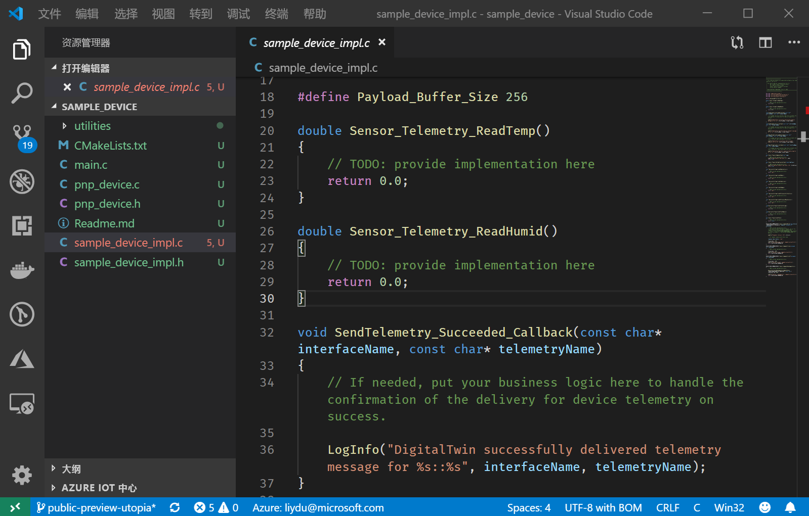

# <a name="quickstart-use-a-device-capability-model-to-create-an-iot-plug-and-play-device"></a>快速入门：使用设备功能模型创建 IoT 即插即用设备

_设备功能模型_ (DCM) 描述 IoT 即插即用设备的功能。 DCM 通常与产品 SKU 相关联。 DCM 中定义的功能组织成可重复使用的接口。 可以基于 DCM 生成主干设备代码。 本快速入门介绍如何在 VS Code 中使用 DCM 创建 IoT 即插即用设备。

## <a name="prerequisites"></a>先决条件

若要完成本快速入门，需在本地计算机上安装以下软件：

* [Visual Studio（社区版、专业版或企业版）](https://visualstudio.microsoft.com/downloads/)- 安装 Visual Studio 时，请确保包括“NuGet 包管理器”组件和“使用 C++ 的桌面开发”工作负荷。  
* [Git](https://git-scm.com/download/)。
* [CMake](https://cmake.org/download/)。
* [Visual Studio Code](https://code.visualstudio.com/)。

### <a name="install-azure-iot-tools"></a>安装 Azure IoT Tools

使用以下步骤安装[适用于 VS Code 的 Azure IoT Tools](https://marketplace.visualstudio.com/items?itemName=vsciot-vscode.azure-iot-tools) 扩展包：

1. 在 VS Code 中选择“扩展”选项卡。 
1. 搜索“Azure IoT Tools”  。
1. 选择“安装”  。

### <a name="install-the-azure-iot-explorer"></a>安装 Azure IoT 资源管理器

从[最新版本](https://github.com/Azure/azure-iot-explorer/releases)页下载并安装 Azure IoT 资源管理器工具。

### <a name="get-the-connection-string-for-your-company-model-repository"></a>获取公司模型存储库的连接字符串

使用 Microsoft 工作或学校帐户（或者 Microsoft 合作伙伴 ID，如果有）登录后，可以在 [Azure IoT 认证门户](https://preview.catalog.azureiotsolutions.com)中找到你的公司模型存储库连接字符串。  登录后，依次选择“公司存储库”、“连接字符串”。  

[!INCLUDE [cloud-shell-try-it.md](../../includes/cloud-shell-try-it.md)]

## <a name="prepare-an-iot-hub"></a>准备 IoT 中心

Azure 订阅中还需要有一个 Azure IoT 中心才能完成本快速入门。 如果没有 Azure 订阅，请在开始之前创建一个[免费帐户](https://azure.microsoft.com/free/?WT.mc_id=A261C142F)。

> [!NOTE]
> 在公共预览版期间，IoT 即插即用功能仅适用于在美国中部、欧洲北部和日本东部区域中创建的 IoT 中心    。

添加适用于 Azure CLI 的 Microsoft Azure IoT 扩展：

```azurecli-interactive
az extension add --name azure-cli-iot-ext
```

运行以下命令，在 IoT 中心创建设备标识。 将 **YourIoTHubName** 和 **YourDevice** 占位符替换为实际名称。 如果你没有 IoT 中心，请遵照[此处的说明创建一个](../iot-hub/iot-hub-create-using-cli.md)：

```azurecli-interactive
az iot hub device-identity create --hub-name [YourIoTHubName] --device-id [YourDevice]
```

运行以下命令，获取刚注册设备的设备连接字符串： 

```azurecli-interactive
az iot hub device-identity show-connection-string --hub-name [YourIoTHubName] --device-id [YourDevice] --output table
```

运行以下命令，获取中心的 IoT 中心连接字符串： 

```azurecli-interactive
az iot hub show-connection-string --hub-name [YourIoTHubName] --output table
```

## <a name="prepare-the-development-environment"></a>准备开发环境

### <a name="get-azure-iot-device-sdk-for-c"></a>获取适用于 C 的 Azure IoT 设备 SDK

在本快速入门中，你将准备一个用于克隆和生成 Azure IoT C 设备 SDK 的开发环境。

1. 打开命令提示符。 执行以下命令克隆 [Azure IoT C SDK](https://github.com/Azure/azure-iot-sdk-c) GitHub 存储库：

    ```cmd/sh
    git clone https://github.com/Azure/azure-iot-sdk-c --recursive -b public-preview
    ```

    应该预料到此操作需要几分钟才能完成。

1. 在存储库本地副本的根目录中创建一个 `pnp_app` 子目录。 使用此文件夹来存储设备模型文件和设备代码存根。

    ```cmd/sh
    cd azure-iot-sdk-c
    mkdir pnp_app
    ```

## <a name="author-your-model"></a>创作模型

在本快速入门中，你将使用现有的示例设备功能模型和关联的接口。

1. 下载[设备功能模型](https://github.com/Azure/IoTPlugandPlay/blob/master/samples/SampleDevice.capabilitymodel.json)和[接口示例](https://github.com/Azure/IoTPlugandPlay/blob/master/samples/EnvironmentalSensor.interface.json)，并将文件保存到 `pnp_app` 文件夹中。

    > [!TIP]
    > 若要从 GitHub 下载某个文件，请导航到该文件，右键单击“原始”，然后选择“链接另存为”。  

1. 使用 VS Code 打开 `pnp_app` 文件夹。 可以使用 Intellisense 查看文件：

    

1. 在下载的文件中，将 `@id` 和 `schema` 字段中的 `<YOUR_COMPANY_NAME_HERE>` 替换为唯一值。 请仅使用字符 a-z、A-Z、0-9 和下划线。 有关详细信息，请参阅[数字孪生标识符格式](https://github.com/Azure/IoTPlugandPlay/tree/master/DTDL#digital-twin-identifier-format)。

## <a name="generate-the-c-code-stub"></a>生成 C 代码存根

现已获得一个 DCM 及其关联的接口，接下来可以生成用于实现该模型的设备代码。 若要在 VS Code 中生成 C 代码存根：

1. 打开包含 DCM 文件的文件夹后，按 **Ctrl+Shift+P** 打开命令面板，输入“IoT 即插即用”，然后选择“生成设备代码存根”。  

    > [!NOTE]
    > 首次使用 IoT 即插即用代码生成器实用工具时，需要花费几秒钟时间来下载组件。

1. 选择用于生成设备代码存根的 DCM 文件。

1. 输入项目名称 **sample_device**，它将成为设备应用程序的名称。

1. 选择“ANSI C”作为语言。 

1. 选择“CMake 项目”作为项目类型。 

1. 选择“通过 IoT 中心设备连接字符串”作为连接方法。 

1. VS Code 将打开一个新窗口，其中包含生成的设备代码存根文件。
    

## <a name="build-the-code"></a>生成代码

使用设备 SDK 来生成设备代码存根。 生成的应用程序将模拟连接到 IoT 中心的设备。 应用程序将发送遥测数据和属性，并接收命令。

1. 在 VS Code 中，打开设备 SDK 根文件夹中的 `CMakeLists.txt`。

1. 在 `CMakeLists.txt` 文件的底部添加以下行，以在编译时包含设备代码存根文件夹：

    ```txt
    add_subdirectory(pnp_app/sample_device)
    ```

1. 在设备 SDK 根文件夹中创建一个 cmake 子目录，并导航到该文件夹：

    ```cmd\sh
    mkdir cmake
    cd cmake
    ```

1. 运行以下命令以生成设备 SDK 和代码存根：

    ```cmd\sh
    cmake .. -Duse_prov_client=ON -Dhsm_type_symm_key:BOOL=ON
    cmake --build . -- /m /p:Configuration=Release
    ```

    > [!NOTE]
    > 如果 cmake 找不到 C++ 编译器，则在运行以上命令时会出现生成错误。 如果出现这种情况，请尝试在 [Visual Studio 命令提示符](https://docs.microsoft.com/dotnet/framework/tools/developer-command-prompt-for-vs)下运行此命令。

1. 成功完成生成后，运行应用程序并传递 IoT 中心设备连接字符串作为参数。

    ```cmd\sh
    cd azure-iot-sdk-c\cmake\pnp_app\sample_device\Release\
    sample_device.exe "[IoT Hub device connection string]"
    ```

1. 设备应用程序将开始向 IoT 中心发送数据。

    

## <a name="validate-the-code"></a>验证代码

### <a name="publish-device-model-files-to-model-repository"></a>将设备模型文件发布到模型存储库

若要使用“Azure IoT 资源管理器”验证设备代码，需将文件发布到模型存储库。 

1. 打开包含 DCM 文件的文件夹后，按 **Ctrl+Shift+P** 打开命令面板，然后键入并选择“IoT 即插即用:  将文件提交到模型存储库”。

1. 选择 `SampleDevice.capabilitymodel.json` 和 `EnvironmentalSensor.interface.json` 文件。

1. 输入公司模型存储库连接字符串。

    > [!NOTE]
    > 仅当首次连接到存储库时，才需要输入连接字符串。

1. 在 VS Code 输出窗口和通知中，可以检查文件是否已成功发布。

    > [!NOTE]
    > 如果在发布设备模型文件时遇到错误，可尝试使用命令“IoT 即插即用:  注销模型存储库”注销，然后再次执行这些步骤。

### <a name="use-the-azure-iot-explorer-to-validate-the-code"></a>使用 Azure IoT 资源管理器验证代码

1. 打开 Azure IoT 资源管理器，此时会看到“应用配置”页。 

1. 输入 IoT 中心连接字符串，然后单击“连接”。 

1. 连接后，将看到设备概述页。

1. 若要添加公司存储库，请依次选择“设置”、“+ 新建”、“公司存储库”。   

1. 添加公司模型存储库连接字符串。 选择“连接”  。

1. 在设备概述页上，找到前面创建的设备标识，然后选择该标识以查看更多详细信息。

1. 展开 ID 为 **urn:azureiot:EnvironmentalSensor:1** 的接口，以查看 IoT 即插即用基元 - 属性、命令和遥测。

1. 选择“遥测”页查看设备正在发送的遥测数据。 

1. 选择“属性(不可写)”页查看设备报告的不可写属性。 

1. 选择“属性(可写)”页查看可以更新的可写属性。 

1. 展开属性**名称**，更新为新名称，然后选择“更新可写属性”。  
2. 若要查看“报告的属性”列中显示的新名称，请单击页面顶部的“刷新”按钮。  

1. 选择“命令”页查看设备支持的所有命令。 

1. 展开 **blink** 命令并设置新的闪烁时间间隔。 选择“发送命令”以调用设备上的命令。 

1. 转到模拟设备，验证该命令是否按预期方式执行。

## <a name="next-steps"></a>后续步骤

本快速入门已介绍如何使用 DCM 创建 IoT 即插即用设备。

若要详细了解 IoT 即插即用，请继续学习以下教程：

> [!div class="nextstepaction"]
> [使用 Visual Studio Code 创建和测试设备功能模型](tutorial-pnp-visual-studio-code.md)
