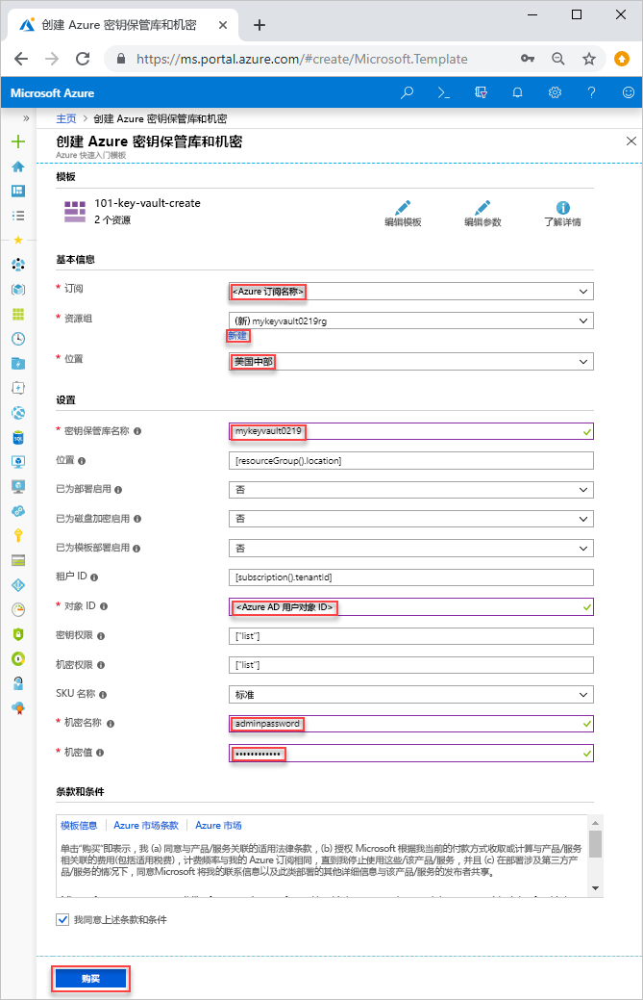
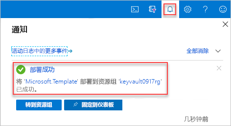

# <a name="quickstart-set-and-retrieve-a-secret-from-azure-key-vault-using-resource-manager-template"></a>快速入门：使用资源管理器模板设置机密以及从 Azure Key Vault 检索机密

[Azure Key Vault](./key-vault-overview.md) 是为密钥、密码、证书等机密及其他机密提供安全存储的云服务。 本快速入门重点介绍部署资源管理器模板用于创建 Key Vault 和机密的过程。

[资源管理器模板](../azure-resource-manager/template-deployment-overview.md)是定义项目基础结构和配置的 JavaScript 对象表示法 (JSON) 文件。 该模板使用声明性语法，使你可以声明要部署的内容，而不需要编写一系列编程命令来进行创建。 若要详细了解如何开发资源管理器模板，请参阅[资源管理器文档](/azure/azure-resource-manager/)和[模板参考](/azure/templates/microsoft.keyvault/allversions)。

如果没有 Azure 订阅，请在开始之前创建一个[免费帐户](https://azure.microsoft.com/free/?WT.mc_id=A261C142F)。

## <a name="prerequisites"></a>先决条件

若要完成本文，需要做好以下准备：

* 模板需要使用你的 Azure AD 用户对象 ID 来配置权限。 以下过程获取对象 ID (GUID)。

    1. 运行以下 Azure PowerShell 或 Azure CLI 命令：选择“试用”，然后在 shell 窗格中粘贴脚本。  若要粘贴脚本，请右键单击 shell，然后选择“粘贴”  。

        # <a name="clitabcli"></a>[CLI](#tab/CLI)
        ```azurecli-interactive
        echo "Enter your email address that is used to sign in to Azure:" &&
        read upn &&
        az ad user show --id $upn --query "objectId" &&
        echo "Press [ENTER] to continue ..."
        ```

        # <a name="powershelltabpowershell"></a>[PowerShell](#tab/PowerShell)
        ```azurepowershell-interactive
        $upn = Read-Host -Prompt "Enter your email address used to sign in to Azure"
        (Get-AzADUser -UserPrincipalName $upn).Id
        Write-Host "Press [ENTER] to continue..."
        ```

        ---

    2. 请记下对象 ID， 本快速入门的下一部分需要使用该 ID。

## <a name="create-a-vault-and-a-secret"></a>创建保管库和机密

本快速入门中使用的模板来自 [Azure 快速入门模板](https://azure.microsoft.com/resources/templates/101-key-vault-create/)。

[!code-json[<Azure Resource Manager template create key vault>](~/quickstart-templates/101-key-vault-create/azuredeploy.json)]

该模板中定义了两个 Azure 资源：

* **Microsoft.KeyVault/vaults**：创建 Azure 密钥保管库。
* **Microsoft.KeyVault/vaults/secrets**：创建密钥保管库机密。

可在[此处](https://azure.microsoft.com/resources/templates/?resourceType=Microsoft.Keyvault)找到更多的 Azure Key Vault 模板示例。

1. 选择下图登录到 Azure 并打开一个模板。 该模板将创建 Key Vault 和机密。

    <a href="https://portal.azure.com/#create/Microsoft.Template/uri/https%3A%2F%2Fraw.githubusercontent.com%2FAzure%2Fazure-quickstart-templates%2Fmaster%2F101-key-vault-create%2Fazuredeploy.json"></a>

2. 选择或输入以下值。

    

    除非另有指定，否则请使用默认值创建 Key Vault 和机密。

    * **订阅**：选择一个 Azure 订阅。
    * **资源组**：选择“新建”，输入资源组的唯一名称，然后单击“确定”。  
    * **位置**：选择一个位置。  例如“美国中部”。 
    * **密钥保管库名称**：输入密钥保管库的名称，该名称在 .vault.azure.net 命名空间中必须全局唯一。 在下一部分验证部署时，需要该名称。
    * **租户 ID**：模板函数会自动检索租户 ID。不要更改默认值。
    * **AD 用户 ID**：输入在[先决条件](#prerequisites)中检索到的 Azure AD 用户对象 ID。
    * **机密名称**：输入要存储在 Key Vault 中的机密的名称。  例如 **adminpassword**。
    * **机密值**：输入机密值。  如果存储密码，则我们建议使用在“先决条件”中创建的生成密码。
    * **我同意上述条款和条件**：选中。
3. 选择“购买”。  成功部署密钥保管库后，你会收到通知：

    

使用 Azure 门户部署模板。 除了 Azure 门户，还可以使用 Azure PowerShell、Azure CLI 和 REST API。 若要了解其他部署方法，请参阅[部署模板](../azure-resource-manager/resource-group-template-deploy.md)。

## <a name="validate-the-deployment"></a>验证部署

可以使用 Azure 门户检查 Key Vault 和机密，或者使用以下 Azure CLI 或 Azure PowerShell 脚本列出创建的机密。

# <a name="clitabcli"></a>[CLI](#tab/CLI)

```azurecli-interactive
echo "Enter your key vault name:" &&
read keyVaultName &&
az keyvault secret list --vault-name $keyVaultName &&
echo "Press [ENTER] to continue ..."
```

# <a name="powershelltabpowershell"></a>[PowerShell](#tab/PowerShell)

```azurepowershell-interactive
$keyVaultName = Read-Host -Prompt "Enter your key vault name"
Get-AzKeyVaultSecret -vaultName $keyVaultName
Write-Host "Press [ENTER] to continue..."
```

---

输出如下所示：

# <a name="clitabcli"></a>[CLI](#tab/CLI)


# <a name="powershelltabpowershell"></a>[PowerShell](#tab/PowerShell)


---
## <a name="clean-up-resources"></a>清理资源

其他 Key Vault 快速入门和教程是在本快速入门的基础上制作的。 如果打算继续使用后续的快速入门和教程，则可能需要保留这些资源。
如果不再需要资源组，可以将其删除，这将删除 Key Vault 和相关的资源。 使用 Azure CLI 或 Azure PowerShell 删除资源组：

# <a name="clitabcli"></a>[CLI](#tab/CLI)

```azurecli-interactive
echo "Enter the Resource Group name:" &&
read resourceGroupName &&
az group delete --name $resourceGroupName &&
echo "Press [ENTER] to continue ..."
```

# <a name="powershelltabpowershell"></a>[PowerShell](#tab/PowerShell)

```azurepowershell-interactive
$resourceGroupName = Read-Host -Prompt "Enter the Resource Group name"
Remove-AzResourceGroup -Name $resourceGroupName
Write-Host "Press [ENTER] to continue..."
```

---

## <a name="next-steps"></a>后续步骤

在本快速入门中，你使用 Azure 资源管理器模板创建了密钥保管库和机密，并验证了部署。 若要详细了解 Key Vault 和 Azure 资源管理器，请继续阅读以下文章。

- 阅读 [Azure Key Vault 概述](key-vault-overview.md)
- 了解有关 [Azure 资源管理器](../azure-resource-manager/resource-group-overview.md)的详细信息
- 获取有关[密钥、机密和证书](about-keys-secrets-and-certificates.md)的详细信息
- 查看 [Azure Key Vault 最佳做法](key-vault-best-practices.md)