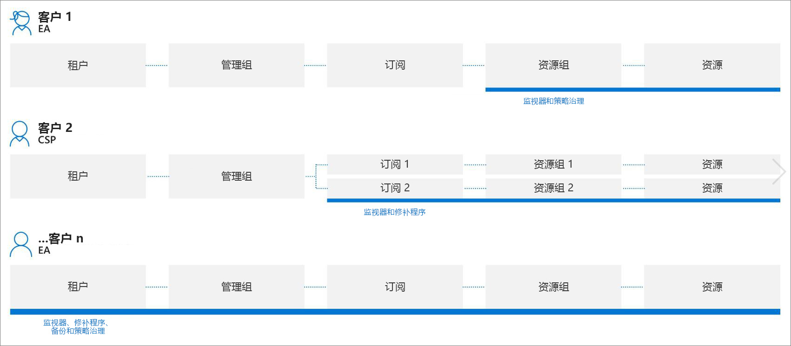
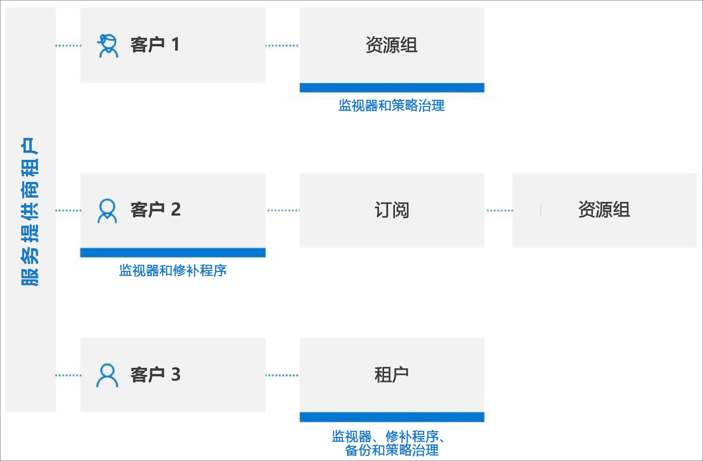

# 跨租户管理体验

本文描述了适用于服务提供商的一些方案，这些方案可与 [Azure 委派资源管理](../concepts/azure-delegated-resource-management.md)配合使用，以便在 [Azure 门户](https://portal.azure.com)中为租户内的多个客户管理 Azure 资源。

> [!NOTE]
> 还可在拥有多个租户的企业中使用 Azure 委派资源管理，以简化跨租户管理。

## 理解客户租户

Azure Active Directory (Azure AD) 租户表示组织。 它是组织通过注册 Azure、Microsoft 365 或其他服务与 Microsoft 建立关系时接收的 Azure AD 的专用实例。 每个 Azure AD 租户都是独特的，独立于其他 Azure AD 租户，且具有其自己的租户 ID (GUID)。 有关详细信息，请参阅[什么是 Azure Active Directory？](https://docs.microsoft.com/azure/active-directory/fundamentals/active-directory-whatis)

通常，为管理客户的 Azure 资源，服务提供商必须使用与该客户的租户相关联的帐户登录 Azure 门户，要求客户租户中的管理员为该服务提供商创建和管理用户帐户。

使用 Azure 委派资源管理时，加入过程会指定服务提供商租户中能够访问和管理客户租户中的订阅、资源组和资源的用户。 然后，这些用户可以使用自己的凭据登录到 Azure 门户。 在 Microsoft Azure 门户中，这些用户可以管理其有权访问的所有客户的资源。 为此，可以访问 Microsoft Azure 门户中的[我的客户](../how-to/view-manage-customers.md)页，或直接在该客户订阅的上下文中工作（在 Azure 门户中或通过 API）。

Azure 委派资源管理可更灵活地管理多个客户的资源，而无需登录到不同租户中的不同帐户。 例如，服务提供商可能有三个客户，各自具有不同的责任和访问级别，如下所示：

使用 Azure 委派资源管理，授权用户可以登录到服务提供商的租户来访问这些资源，如下所示：

## 支持的服务和方案

目前，跨租户管理体验对于委派的客户资源支持以下方案：

[Azure 自动化](https://docs.microsoft.com/azure/automation/)：

- 通过自动化帐户来访问和使用委派的客户资源

[Azure 备份](https://docs.microsoft.com/azure/backup/)：

- 备份并还原客户租户中的客户数据

[Azure Kubernetes 服务 (AKS)](https://docs.microsoft.com//azure/aks/)：

- 管理托管的 Kubernetes 环境并部署和管理客户租户中的容器化应用程序

[Azure Monitor](https://docs.microsoft.com/azure/azure-monitor/)：

- 在 Microsoft Azure 门户中查看委托订阅的警报，或通过 REST API 调用以编程方式查看所有订阅中的警报
- 查看委派订阅的活动日志详细信息
- 日志分析：从多个租户中的远程客户工作区查询数据

[Azure Policy](https://docs.microsoft.com/azure/governance/policy/)：

- 符合性快照显示委派订阅中分配的策略的详细信息
- 在委派订阅中创建和编辑策略定义
- 在委派订阅中分配客户定义的策略定义
- 客户将看到由服务提供商和自己创建的策略
- 如果客户为该策略分配配置了托管标识和 roleDefinitionIds，则可以修正客户租户中的 deployIfNotExists 分配 

[Azure Resource Graph](https://docs.microsoft.com/azure/governance/resource-graph/)：

- 现在，在返回的查询结果中包含租户 ID，以便确定订阅是属于客户租户还是服务提供商租户

[Azure 安全中心](https://docs.microsoft.com/azure/security-center/)：

- 跨租户可见性
  - 监视安全策略的符合性，并确保跨所有租户资源的安全覆盖
  - 单个视图中跨多个客户的连续合规性监视
  - 通过安全分数计算监视、会审可操作安全建议，并设置其优先级
- 跨租户安全状况管理
  - 管理安全策略
  - 对不符合可操作安全建议的资源执行操作
  - 收集并存储安全相关数据
- 跨租户威胁检测和保护
  - 跨租户资源检测威胁
  - 应用高级威胁防护控制（如实时 (JIT) VM 访问）
  - 通过自适应网络强化来强化网络安全组配置
  - 通过自适应应用程序控制，确保服务器仅运行适当的应用程序和进程
  - 运用文件完整性监视 (FIM) 监视对重要文件和注册表项的更改

[Azure Sentinel](https://docs.microsoft.com/azure/sentinel/multiple-tenants-service-providers)：

- 管理客户租户中的 Azure Sentinel 资源

[Azure 服务运行状况](https://docs.microsoft.com/azure/service-health/)：

- 通过 Azure 资源运行状况监视客户资源的运行状况
- 跟踪客户使用的 Azure 服务的运行状况

[Azure Site Recovery](https://docs.microsoft.com/azure/site-recovery/)：

- 为客户租户中的 Azure 虚拟机管理灾难恢复选项（请注意，不能使用运行方式帐户复制 VM 扩展）

[Azure 虚拟机](https://docs.microsoft.com/azure/virtual-machines/)：

- 使用虚拟机扩展在客户租户的 Azure VM 上提供部署后配置和自动化任务
- 使用启动诊断对客户租户中的 Azure VM 进行故障排除
- 使用客户租户中的串行控制台访问 VM
- 请注意，不能使用 Azure Active Directory 远程登录 VM，并且不能将 VM 与密码、机密或加密密钥的保管库相集成以进行磁盘加密

[Azure 虚拟网络](https://docs.microsoft.com/azure/virtual-network/)：

- 在客户租户内部署和管理虚拟网络和虚拟网络接口卡 (vNIC)

支持请求：

- 从 Microsoft Azure 门户中的“帮助 + 支持”边栏选项卡中，打开对委派资源的支持请求（选择对委派范围可用的支持计划） 

## 当前限制
对于所有方案，都请注意以下当前限制：

- 可以使用 Azure 委派资源管理执行 Azure 资源管理器处理的请求。 这些请求的操作 URI 都以 `https://management.azure.com` 开头。 但是，Azure 委派资源管理不支持由资源类型的实例处理的请求（如 KeyVault 机密访问或存储数据访问）。 这些请求的操作 URI 通常以实例特有的地址开头，例如 `https://myaccount.blob.core.windows.net` 或 `https://mykeyvault.vault.azure.net/`。 后者通常也是数据操作，而不是管理操作。 
- 角色分配必须使用基于角色的访问控制 (RBAC) [内置角色](https://docs.microsoft.com/azure/role-based-access-control/built-in-roles)。 除所有者、用户访问管理员或具有 [DataActions](https://docs.microsoft.com/azure/role-based-access-control/role-definitions#dataactions) 权限的任何内置角色外，Azure 委派资源管理当前支持所有内置角色。 也不支持自定义角色和[经典订阅管理员角色](https://docs.microsoft.com/azure/role-based-access-control/classic-administrators)。
- 目前，如果订阅使用 Azure Databricks，则无法将订阅（或订阅内的资源组）载入到 Azure 委托资源管理。 同样，如果订阅已注册为通过 Microsoft.ManagedServices 资源提供程序加入，则目前无法为该订阅创建 Databricks 工作区  。

## 使用 API 和管理工具进行跨租户管理

对于上面列出的支持服务和方案，你可以直接在门户中执行管理任务，也可以使用 API 和管理工具（如 Azure CLI 和 Azure PowerShell）执行管理任务。 处理（受支持服务的）委派资源时，所有现有的 API 都可用。

还有一些特定于执行 Azure 委派资源管理任务的 API。 有关详细信息，请参阅“参考”部分  。

## 后续步骤

- 要将客户加入 Azure 委派资源管理，可以[使用 Azure 资源管理器模板](../how-to/onboard-customer.md)，或[将专用或公共托管服务发布到 Microsoft Azure 市场](../how-to/publish-managed-services-offers.md)。
- 在 Microsoft Azure 门户中转到“我的客户”，以[查看和管理客户](../how-to/view-manage-customers.md)  。
