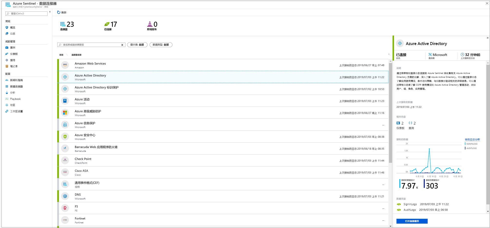
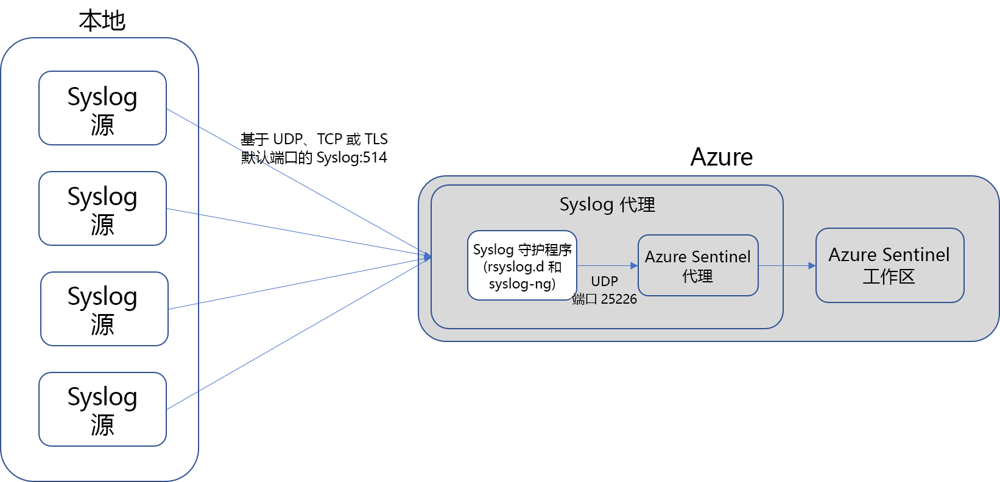

# 连接数据源

若要载入 Azure Sentinel，首先需要连接到数据源。 Azure Sentinel 随附许多适用于 Microsoft 解决方案的现成可用的连接器，提供实时集成（包括 Microsoft 威胁防护解决方案）和 Microsoft 365 源（包括 Office 365、Azure AD、Azure ATP 和 Microsoft Cloud App Security，等等）。 此外，内置的连接器可以拓宽非 Microsoft 解决方案的安全生态系统。 也可以使用常用事件格式 Syslog 或 REST-API 将数据源与 Azure Sentinel 相连接。  

1. 在菜单上，选择“数据连接器”  。 通过此页，可以查看 Azure Sentinel 提供的连接器及其状态的完整列表。 选择要连接的连接器，然后选择“打开连接器页”  。 

   

1. 在特定连接器页上，确保已满足所有先决条件，并按照相关说明将数据连接到 Azure Sentinel。 可能需要一段时间才能让日志开始与 Azure Sentinel 保持同步。 在连接后，可以在“收到的数据”图  中查看数据摘要，以及数据类型的连接状态。

   
  
1. 单击“后续步骤”  选项卡，以获取 Azure Sentinel 针对特定数据类型提供的现成内容的列表。

   
 

## 数据连接方法

Azure Sentinel 支持以下数据连接方法：

- **Microsoft 服务**：  Microsoft 服务原生是互连的。利用 Azure 基础服务的现成集成，只需单击几点鼠标就能连接以下解决方案：
    - [Office 365](connect-office-365.md)
    - [Azure AD 审核日志和登录](connect-azure-active-directory.md)
    - [Azure 活动](connect-azure-activity.md)
    - [Azure AD 标识保护](connect-azure-ad-Identity-protection.md)
    - [Azure 安全中心](connect-azure-security-center.md)
    - [Azure 信息保护](connect-azure-information-protection.md)
    - [Azure 高级威胁防护](connect-azure-atp.md)
    - [Cloud App Security](connect-cloud-app-security.md)
    - [Windows 安全事件](connect-windows-security-events.md) 
    - [Windows 防火墙](connect-windows-firewall.md)

- **通过 API 连接外部解决方案**：可以使用联网数据源提供的 API 连接某些数据源。 一般情况下，大多数安全技术都会提供一组 API，通过这些 API 可以检索事件日志。这些 API 连接到 Azure Sentinel，收集特定的数据类型并将其发送到 Azure Log Analytics。 通过 API 连接的设备包括：
    - [Barracuda](connect-barracuda.md)
    - [Symantec](connect-symantec.md)
- **通过代理连接外部解决方案**：可以通过代理使用 Syslog 协议将 Azure Sentinel 连接到可执行实时日志流式处理的其他所有数据源。  大部分设备使用 Syslog 协议发送包含日志本身以及日志相关数据的事件消息。 日志格式各不相同，但大部分设备支持通用事件格式 (CEF) 标准。  基于 Log Analytics 代理的 Azure Sentinel 代理会将 CEF 格式的日志转换为可供 Log Analytics 引入的格式。 根据设备类型，可以直接在设备上安装代理，或者在专用的 Linux 服务器上安装代理。 适用于 Linux 的代理通过 UDP 从 Syslog 守护程序接收事件，但如果预期 Linux 计算机需要收集大量的 Syslog 事件，则会通过 TCP 将这些事件从 Syslog 守护程序发送到代理，然后从代理发送到 Log Analytics。
    - 防火墙、代理和终结点：
        - [F5](connect-f5.md)
        - [Check Point](connect-checkpoint.md)
        - [Cisco ASA](connect-cisco.md)
        - [Fortinet](connect-fortinet.md)
        - [Palo Alto](connect-paloalto.md)
        - [其他 CEF 设备](connect-common-event-format.md)
        - [其他 Syslog 设备](connect-syslog.md)
    - DLP 解决方案
    - [威胁智能提供程序](connect-threat-intelligence.md)
    - [DNS 计算机](connect-dns.md) - 直接安装在 DNS 计算机上的代理
    - Linux 服务器
    - 其他云
    
## 代理连接选项

若要将外部设备连接到 Azure Sentinel，代理必须部署在专用计算机上（VM 或本地），以支持设备与 Azure Sentinel 之间的通信。 可以自动或手动部署代理。 仅当专用计算机是在 Azure 中创建的新 VM 时，才能进行自动部署。 

或者，可以在现有的 Azure VM 上、在其他云中的 VM 上或者在本地计算机上手动部署代理。

## 使用 Azure Sentinel 连接选项映射数据类型

| **数据类型** | **如何连接** | **数据连接器？** | **注释** |
|------|---------|-------------|------|
| AWSCloudTrail | [连接 AWS](connect-aws.md) | V | |
| AzureActivity | [连接 Azure 活动](connect-azure-activity.md)和[活动日志概述](../azure-monitor/platform/activity-logs-overview.md)| V | |
| AuditLogs | [连接 Azure AD](connect-azure-active-directory.md)  | V | |
| SigninLogs | [连接 Azure AD](connect-azure-active-directory.md)  | V | |
| AzureFirewall |[Azure 诊断](../firewall/tutorial-diagnostics.md) | V | |
| InformationProtectionLogs_CL  | [Azure 信息保护报告](https://docs.microsoft.com/azure/information-protection/reports-aip) [连接 Azure 信息保护](connect-azure-information-protection.md)  | V | 除数据类型外，这通常还使用 **InformationProtectionEvents** 函数。 有关详细信息，请参阅[如何修改报告和创建自定义查询](https://docs.microsoft.com/azure/information-protection/reports-aip#how-to-modify-the-reports-and-create-custom-queries)|
| AzureNetworkAnalytics_CL  | [流量分析架构](../network-watcher/traffic-analytics.md) [流量分析](../network-watcher/traffic-analytics.md)  | | |
| CommonSecurityLog  | [连接 CEF](connect-common-event-format.md)  | V | |
| OfficeActivity | [连接 Office 365](connect-office-365.md) | V | |
| SecurityEvents | [连接 Windows 安全事件](connect-windows-security-events.md)  | V | 有关不安全协议工作簿的信息，请参阅[不安全协议工作簿设置](https://blogs.technet.microsoft.com/jonsh/azure-sentinel-insecure-protocols-dashboard-setup/)  |
| Syslog | [连接 Syslog](connect-syslog.md) | V | |
| Microsoft Web 应用程序防火墙 (WAF) - (AzureDiagnostics) |[连接 Microsoft Web 应用程序防火墙](connect-microsoft-waf.md) | V | |
| SymantecICDx_CL | [连接 Symantec](connect-symantec.md) | V | |
| ThreatIntelligenceIndicator  | [连接威胁智能](connect-threat-intelligence.md)  | V | |
| VMConnection   ServiceMapComputer_CL  ServiceMapProcess_CL|  [Azure Monitor 服务映射](../azure-monitor/insights/service-map.md) [Azure Monitor VM 见解载入](../azure-monitor/insights/vminsights-onboard.md)   [启用 Azure Monitor VM 见解](../azure-monitor/insights/vminsights-enable-overview.md)   [使用单一 VM 载入](../azure-monitor/insights/vminsights-enable-single-vm.md)   [通过 Policy 使用载入](../azure-monitor/insights/vminsights-enable-at-scale-policy.md)| X | VM 见解工作簿  |
| DnsEvents | [连接 DNS](connect-dns.md) | V | |
| W3CIISLog | [连接 IIS 日志](../azure-monitor/platform/data-sources-iis-logs.md)  | X | |
| WireData | [连接 Wire Data](../azure-monitor/insights/wire-data.md) | X | |
| WindowsFirewall | [连接 Windows 防火墙](connect-windows-firewall.md) | V | |
| AADIP SecurityAlert  | [连接 Azure AD 标识保护](connect-azure-ad-identity-protection.md)  | V | |
| AATP SecurityAlert  | [连接 Azure ATP](connect-azure-atp.md) | V | |
| ASC SecurityAlert  | [连接 Azure 安全中心](connect-azure-security-center.md)  | V | |
| MCAS SecurityAlert  | [连接 Microsoft Cloud App Security](connect-cloud-app-security.md)  | V | |
| SecurityAlert | | | |
| Sysmon（事件） | [连接 Sysmon](https://azure.microsoft.com/blog/detecting-in-memory-attacks-with-sysmon-and-azure-security-center)  [连接 Windows 事件](../azure-monitor/platform/data-sources-windows-events.md)   [获取 Sysmon 分析程序](https://github.com/Azure/Azure-Sentinel/blob/master/Parsers/SysmonParser.txt)| X | 默认情况下，虚拟机上未安装 Sysmon 集合。 有关如何安装 Sysmon 代理的详细信息，请参阅 [Sysmon](https://docs.microsoft.com/sysinternals/downloads/sysmon)。 |
| ConfigurationData  | [自动执行 VM 清单](../automation/automation-vm-inventory.md)| X | |
| ConfigurationChange  | [自动执行 VM 跟踪](../automation/change-tracking.md) | X | |
| F5 BIG-IP | [连接 F5 BIG-IP](https://devcentral.f5.com/s/articles/Integrating-the-F5-BIGIP-with-Azure-Sentinel.md)  | X | |
| McasShadowItReporting  |  | X | |
| Barracuda_CL | [连接 Barracuda](connect-barracuda.md) | V | |

## 后续步骤

- 若要开始使用 Azure Sentinel，需要订阅 Microsoft Azure。 如果尚无订阅，可注册[免费试用版](https://azure.microsoft.com/free/)。
- 了解如何[将数据载入到 Azure Sentinel](quickstart-onboard.md)，以及[获取数据和潜在威胁的见解](quickstart-get-visibility.md)。
