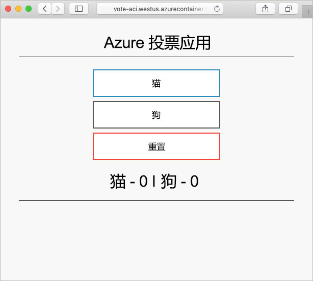

# <a name="create-a-terraform-configuration-for-azure"></a>创建适用于 Azure 的 Terraform 配置

本示例提供有关创建 Terraform 配置并将其部署到 Azure 的经验。 完成后，即已部署一个 Azure Cosmos DB 实例、一个 Azure 容器实例，以及一个可跨这两个资源运行的应用程序。 本文档假设所有工作在预装了 Terraform 工具的 Azure Cloud Shell 中完成。 若要在自己的系统上演练本示例，可以遵照[此处](../virtual-machines/linux/terraform-install-configure.md)的说明安装 Terraform。

## <a name="create-first-configuration"></a>创建第一个配置

在本部分，你将创建 Azure Cosmos DB 实例的配置。

选择“立即试用”打开 Azure Cloud Shell。  打开后，输入 `code .` 打开 Cloud Shell 代码编辑器。

```bash
code .
```

复制并粘贴以下 Terraform 配置。

此配置为 Azure 资源组、随机整数和 Azure Cosmos DB 实例建模。 该随机整数在 Cosmos DB 实例名称中使用。 还可以配置多个 Cosmos DB 设置。 有关 Cosmos DB Terraform 配置的完整列表，请参阅 [Cosmos DB Terraform 参考](https://www.terraform.io/docs/providers/azurerm/r/cosmosdb_account.html)。

完成后，将文件另存为 `main.tf`。 可以使用代码编辑器右上方的省略号完成此操作。

```hcl
resource "azurerm_resource_group" "vote-resource-group" {
  name     = "vote-resource-group"
  location = "westus"
}

resource "random_integer" "ri" {
  min = 10000
  max = 99999
}

resource "azurerm_cosmosdb_account" "vote-cosmos-db" {
  name                = "tfex-cosmos-db-${random_integer.ri.result}"
  location            = "${azurerm_resource_group.vote-resource-group.location}"
  resource_group_name = "${azurerm_resource_group.vote-resource-group.name}"
  offer_type          = "Standard"
  kind                = "GlobalDocumentDB"

  consistency_policy {
    consistency_level       = "BoundedStaleness"
    max_interval_in_seconds = 10
    max_staleness_prefix    = 200
  }

  geo_location {
    location          = "westus"
    failover_priority = 0
  }
}
```

[terraform init](https://www.terraform.io/docs/commands/init.html) 命令初始化工作目录。 在 Cloud Shell 终端中运行 `terraform init`，以准备部署新配置。

```bash
terraform init
```

可以使用 [terraform plan](https://www.terraform.io/docs/commands/plan.html) 命令来验证配置的格式是否正确，以及直观显示要创建、更新或销毁哪些资源。 可将结果存储在某个文件中，稍后可以使用该文件来应用配置。

运行 `terraform plan` 以测试新的 Terraform 配置。

```bash
terraform plan --out plan.out
```

运行 [terraform apply](https://www.terraform.io/docs/commands/apply.html) 并指定计划文件的名称，以应用配置。 此命令在 Azure 订阅中部署资源。

```bash
terraform apply plan.out
```

完成后，可以看到资源组已创建，并且 Azure Cosmos DB 实例已放到该资源组中。

## <a name="update-configuration"></a>更新配置

更新配置以包含 Azure 容器实例。 容器将运行一个在 Cosmos DB 中读取和写入数据的应用程序。

将以下配置复制到 `main.tf` 文件的底部。 完成后，保存该文件。

设置了两个环境变量：`COSMOS_DB_ENDPOINT` 和 `COSMOS_DB_MASTERKEY`。 这些变量保存位置以及用于访问数据库的密钥。 这些变量的值是从上一步骤创建的数据库实例中获取的。 此过程称为内插。 若要详细了解 Terraform 内插，请参阅[内插语法](https://www.terraform.io/docs/configuration/interpolation.html)。


该配置还包含一个输出块，该块返回容器实例的完全限定域名 (FQDN)。

```hcl
resource "azurerm_container_group" "vote-aci" {
  name                = "vote-aci"
  location            = "${azurerm_resource_group.vote-resource-group.location}"
  resource_group_name = "${azurerm_resource_group.vote-resource-group.name}"
  ip_address_type     = "public"
  dns_name_label      = "vote-aci"
  os_type             = "linux"

  container {
    name   = "vote-aci"
    image  = "microsoft/azure-vote-front:cosmosdb"
    cpu    = "0.5"
    memory = "1.5"
    ports {
      port     = 80
      protocol = "TCP"
    }

    secure_environment_variables = {
      "COSMOS_DB_ENDPOINT"  = "${azurerm_cosmosdb_account.vote-cosmos-db.endpoint}"
      "COSMOS_DB_MASTERKEY" = "${azurerm_cosmosdb_account.vote-cosmos-db.primary_master_key}"
      "TITLE"               = "Azure Voting App"
      "VOTE1VALUE"          = "Cats"
      "VOTE2VALUE"          = "Dogs"
    }
  }
}

output "dns" {
  value = "${azurerm_container_group.vote-aci.fqdn}"
}
```

运行 `terraform plan` 以创建更新的计划，并直观显示所要做出的更改。 应会看到，Azure 容器实例资源已添加到该配置。

```bash
terraform plan --out plan.out
```

最后，运行 `terraform apply` 以应用配置。

```bash
terraform apply plan.out
```

完成后，记下容器实例 FQDN。

## <a name="test-application"></a>测试应用程序

导航到容器实例的 FQDN。 如果正确配置了所有设置，应会看到以下应用程序。



## <a name="clean-up-resources"></a>清理资源

完成后，可以使用 [terraform destroy](https://www.terraform.io/docs/commands/destroy.html) 命令删除 Azure 资源和资源组。

```bash
terraform destroy -auto-approve
```

## <a name="next-steps"></a>后续步骤

在本示例中，你已创建、部署并销毁了一个 Terraform 配置。 有关使用 Azure 中的 Terraform 的详细信息，请参阅 Azure Terraform 提供者文档。

> [!div class="nextstepaction"]
> [Azure Terraform 提供者](https://www.terraform.io/docs/providers/azurerm/)
