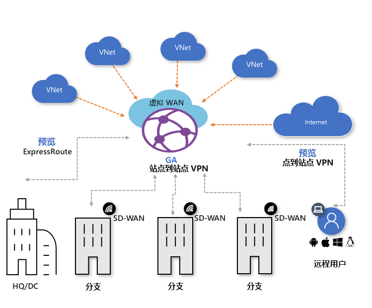

# 什么是 Azure 虚拟 WAN？

Azure Virtual WAN 是一种网络服务，提供到 Azure 并穿过该服务的经优化的自动分支连接。 Azure 区域充当可以选择将分支连接到的中心。 还可以利用 Azure 主干连接分支，享用分支到 VNet 的连接。 我们有一个支持使用 Azure 虚拟 WAN VPN 实现连接自动化的合作伙伴列表。 有关详细信息，请参阅[虚拟 WAN 合作伙伴和位置](virtual-wan-locations-partners.md)一文。

Azure 虚拟 WAN 将许多 Azure 云连接服务（例如，站点到站点 VPN 和 ExpressRoute）汇集到一个操作界面中。 通过使用虚拟网络连接建立与 Azure VNet 的连接。

用于虚拟 WAN 的 ExpressRoute 当前处于预览状态。

本文提供 Azure 虚拟 WAN 中网络连接的快速视图。 虚拟 WAN 提供以下优势：

* **中心和辐射中的集成式连接解决方案：** 在本地站点与 Azure 中心之间自动建立站点到站点配置和连接。
* **自动化的辐射设置和配置：** 将虚拟网络和工作负载无缝连接到 Azure 中心。
* **直观的疑难解答：** 可以查看 Azure 中的端到端流，并使用此信息来执行所需的操作。

## 虚拟 WAN 资源

要配置端到端虚拟 WAN，请创建以下资源：

* **virtualWAN：** virtualWAN 资源表示 Azure 网络的虚拟覆盖，并且是多个资源的集合。 它包含要部署到虚拟 WAN 中的所有虚拟中心的链接。 虚拟 WAN 资源相互隔离，不能包含公用中心。 跨虚拟 WAN 的虚拟中心不会相互通信。 “允许分支到分支流量”属性启用 VPN 站点之间的流量以及启用 ExpressRoute 的 VPN（当前处于预览状态）的站点。

* **中心：** 虚拟中心是 Microsoft 托管的虚拟网络。 中心包含不同的服务终结点，可从本地网络 (vpnsite) 建立连接。 中心是区域中网络的核心。 每个 Azure 区域只能有一个中心。 使用 Azure 门户创建中心时，会创建虚拟中心 VNet 和虚拟中心 vpngateway。

  中心网关与用于 ExpressRoute 和 VPN 网关的虚拟网络网关不同。 例如，使用虚拟 WAN 时，不要直接从本地站点创建与 VNet 的站点到站点连接。 而应与中心建立站点到站点连接。 流量始终通过中心网关。 这意味着，VNet 不需要自身的虚拟网络网关。 虚拟 WAN 可让 VNet 通过虚拟中心和虚拟中心网关轻松利用缩放功能。

* **中心虚拟网络连接：** 中心虚拟网络连接资源用于将中心无缝连接到虚拟网络。 目前，只能连接到同一中心区域内的虚拟网络。

* **中心路由表：** 可以创建一个虚拟中心路由，并将该路由应用于虚拟中心路由表。 可以将多个路由应用于虚拟中心路由表。

**其他虚拟 WAN 资源**

  * **站点：** 此资源仅用于站点到站点连接。 站点资源为 vpnsite  。 它表示本地 VPN 设备及其设置。 可以通过与虚拟 WAN 合作伙伴合作，使用一个内置的解决方案自动将此信息导出到 Azure。

## 连接

虚拟 WAN 允许两种类型的连接：站点到站点和 ExpressRoute（预览版）。

### 站点到站点 VPN 连接

创建虚拟 WAN 站点到站点连接时，可使用可用的合作伙伴。 如果不想使用合作伙伴，则可以手动配置连接。 有关详细信息，请参阅[使用虚拟 WAN 创建站点到站点连接](virtual-wan-site-to-site-portal.md)。

#### 虚拟 WAN 合作伙伴工作流

与虚拟 WAN 合作伙伴合作时，此工作流包括：

1. 分支设备 (VPN/SDWAN) 控制器经过身份验证后，使用 [Azure 服务主体](../active-directory/develop/howto-create-service-principal-portal.md)将站点导向型信息导出到 Azure。
2. 分支设备 (VPN/SDWAN) 控制器获取 Azure 连接配置并更新本地设备。 这样可以自动完成配置下载，以及本地 VPN 设备的编辑和更新。
3. 设备获得正确的 Azure 配置后，将与 Azure WAN 建立站点到站点连接（两个活动隧道）。 Azure 同时支持 IKEv1 和 IKEv2。 BGP 是可选的。

#### 站点到站点虚拟 WAN 连接的合作伙伴

有关可用的合作伙伴和位置的列表，请参阅[虚拟 WAN 合作伙伴和位置](virtual-wan-locations-partners.md)一文。

### ExpressRoute 连接（预览版）

ExpressRoute 允许通过专用连接将本地网络连接到 Azure。 要创建连接，请参阅[使用虚拟 WAN 创建 ExpressRoute 连接](virtual-wan-expressroute-portal.md)。

## 位置

有关位置信息，请参阅[虚拟 WAN 合作伙伴和位置](virtual-wan-locations-partners.md)一文。

## 常见问题解答

[!INCLUDE [Virtual WAN FAQ](../../includes/virtual-wan-faq-include.md)]

## 后续步骤

[使用虚拟 WAN 创建站点到站点连接](virtual-wan-site-to-site-portal.md)
