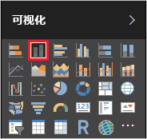
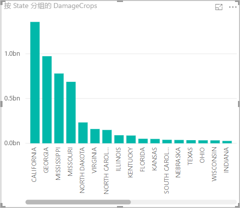

Power BI Desktop 中有了数据以后，即可创建基于该数据的报表。 将创建一个简单的包含柱状图的报表，以便按州显示作物损坏情况。

1. 在 Power BI 主窗口左侧，选择报表视图。

    

1. 在“可视化”  窗格中，选择“簇状柱形图”。

    

    会向画布添加一个空白图。

    

1. 在“字段”  列表中，选择“DamageCrops”  和“州”  。

    

    现在已有一张图表，显示表中最前面 1000 行对应的作物损坏情况。

    

1. 保存报表。