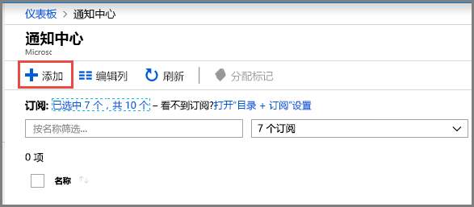
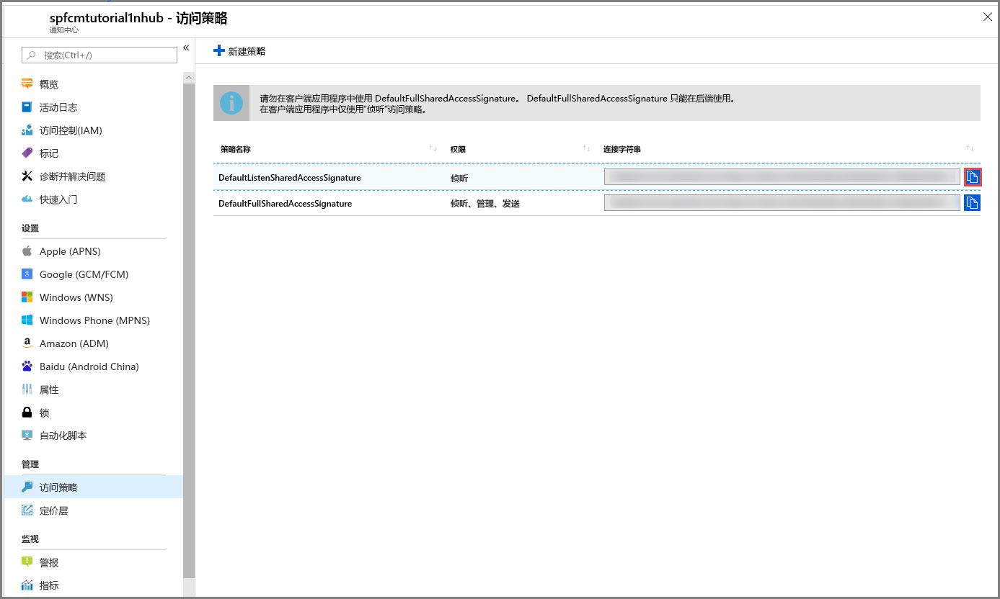

1. 登录到 [Azure 门户](https://portal.azure.com)。

1. 在左侧菜单上选择“所有服务”  ，然后在“移动”部分中选择“通知中心”。   选择服务名称旁边的星形图标，以便将服务添加到左侧菜单上的“收藏夹”部分。  在将“通知中心”  添加到“收藏夹”  之后，在左侧菜单上选择它。

      

1. 在“通知中心”  页面上，在工具栏上选择“添加”  。

      

1. 在“通知中心”  页面上，执行以下步骤：

    1. 将一个名称输入“通知中心”。   

    1. 在“创建新的命名空间”中输入名称。  命名空间包含一个或多个中心。

    1. 从“位置”下拉列表框中选择值。  此值指定要在其中创建通知中心的位置。

    1. 在“资源组”中选择现有的资源组，或者为新资源组创建一个名称。 

    1. 选择“创建”  。

        

1. 选择“通知”（钟形图标），然后选择“转到资源”   。 还可以刷新“通知中心”  页上的列表，然后选择通知中心。

      

1. 从列表中选择“访问策略”  。 记下向你提供的两个连接字符串。 稍后在处理推送通知时需要它们。

      >[!IMPORTANT]
      >请勿  在应用程序中使用 **DefaultFullSharedAccessSignature** 策略。 这只能在后端使用。
      >

      
